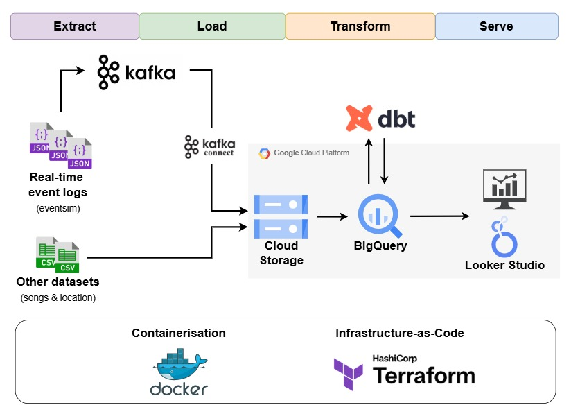
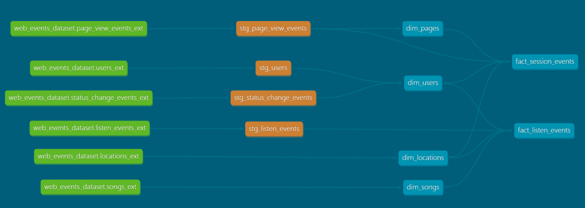
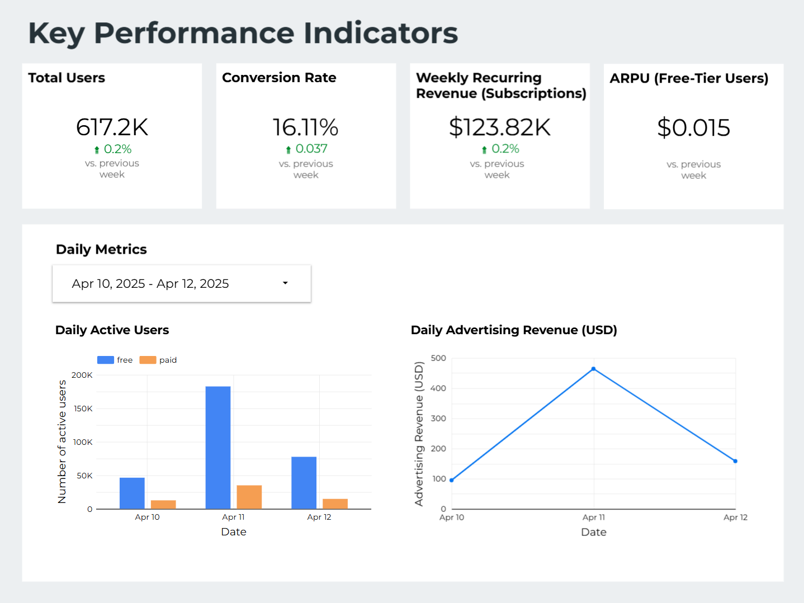
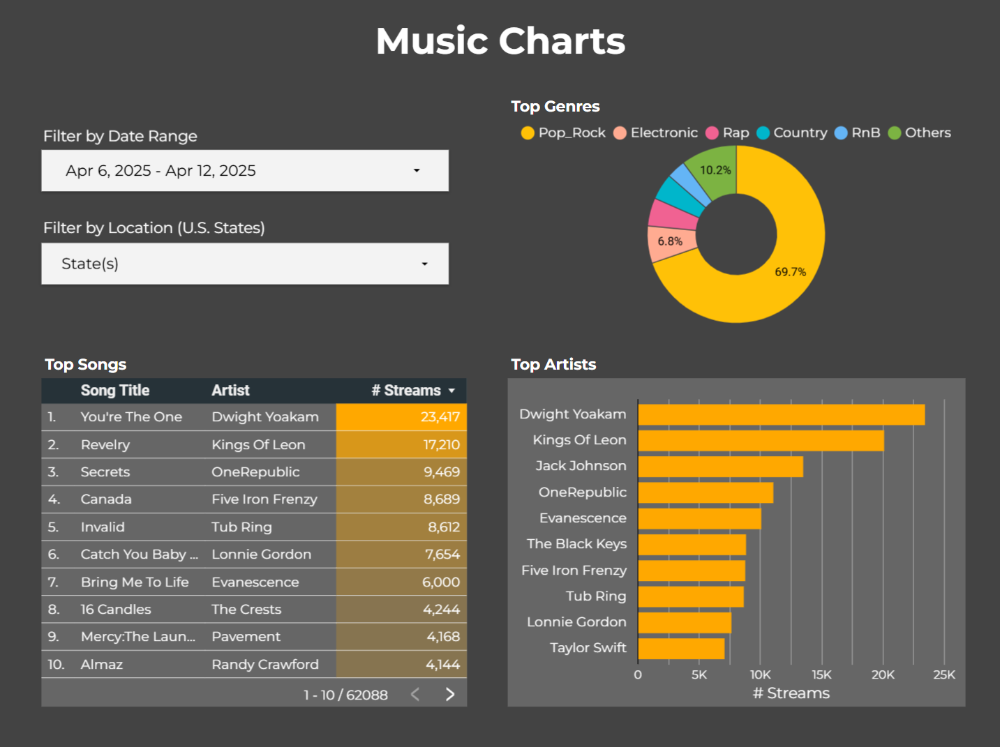

## Project Overview
In this project, I build an end-to-end pipeline that processes data generated by a (mock) music streaming website to
prepare the data for analysis.
The main steps of the pipeline are as follows:
- stream real-time event data generated by the website
- ingest the data into a data lake at regular intervals
- transform the data in the data lake via hourly batch jobs to populate tables in a data warehouse
- build two dashboards using the data warehouse tables

The first dashboard presents key performance indicators (KPIs) of the website and is aimed at business users, while the
second dashboard is aimed at music enthusiasts who are curious about the music being
streamed on the website. Skip ahead to the [dashboard section](#dashboards) to see the final results.

## Table of Contents 
- [Project Overview](#project-overview)
- [Table of Contents](#table-of-contents)
- [Data Source](#data-source)
- [Pipeline](#pipeline)
    - [Architecture](#architecture)
    - [Transformations](#transformations)
    - [Dashboards](#dashboards)
- [Reproducing the project](#reproducing-the-project)
- [Summary of tools used](#summary-of-tools-used)
- [Acknowledgements](#acknowledgements)

## Data Source
[Eventsim](https://github.com/viirya/eventsim) is a program that simulates page requests for a mock music streaming site. 
Data is generated in real time whenever a user opens a page on the website. For this project, I am using my version of 
the program (available [here](https://github.com/cpwill01/eventsim)), which includes bug fixes and additional 
configurations.

The results of the simulation are fake, but they are based on real data. For more information, see the ["About the 
source data" section](https://github.com/cpwill01/eventsim/tree/main?tab=readme-ov-file#about-the-source-data) on the 
eventsim repository.

## Pipeline
### Architecture

The pipeline works as follows:
1. **[Extract & Load]** Data is extracted from the respective sources and loaded into Google Cloud Storage (GCS):
   
   1.  Eventsim publishes its data in real time to 4 topics in Kafka (each for a different type of event). 
   Using the Kafka Connect API, a sink connector is created to consume the data from the Kafka topics and 
   periodically write a json file to GCS. The files are saved in the form
    `<event_type>/date=<ingestion_datetime>/<file_name>`. The use of
    `date=<ingestion_datetime>` in the file path allows us to make use of [**externally partitioned data**](https://cloud.google.com/bigquery/docs/hive-partitioned-queries?hl=en)
    when querying the data from BigQuery later on.
   
   2. Song & Location data are programmatically downloaded from 
      [here](https://github.com/cpwill01/eventsim/tree/main/data) and uploaded to GCS as parquet files using a Python 
   script.

2. **[Transform]** An hourly job is scheduled on dbt Cloud to clean and transform the data into tables in the BigQuery 
Data Warehouse. The data transformations are further elaborated below.
   
3. **[Serve]** By querying from BigQuery as the data source, dashboards are created on Looker Studio.

Note that the components in the "Extract & Load" step are deployed in Docker containers on a Google Compute Engine. This
is so that eventsim continues producing data and the pipeline continues consuming data even when my local machine is
turned off.

### Transformations
The transformation step of the pipeline is written as a dbt project, which can be found in the `pipeline/transforms` 
folder. The lineage for the data transformations are shown in the DAG below:

The external tables (in green) are created to allow us to query the data stored in Cloud Storage without loading it into
BigQuery. These are used to build staging tables (in orange), which are then used to build the fact and dimension tables (in blue).

**A note on partitioning**: Partitioning a table allows us to reduce query time and query costs, as BigQuery will only 
process the data in the relevant partition. They are useful when the table is expected to get very large. Hence, 
partitioning was used for the following tables:
- All external tables for event data (i.e., tables named `..._events_ext`), using [external partitioning](https://cloud.google.com/bigquery/docs/hive-partitioned-queries?hl=en) 
  with ingestion datetime as the partition key for efficient incremental builds of staging tables
- `stg_page_view_events` and `stg_listen_events`, using event datetime as partition key, for efficient incremental builds
  of fact tables
- both fact tables, using event datetime as partition key for more efficient querying from dashboards

### Dashboards
Dashboards were created on Looker Studio by querying the data on BigQuery. Live dashboards are available for viewing at [this link](https://lookerstudio.google.com/reporting/bed243cc-e6d8-49e5-936f-ce499710bf60),
but will eventually be shut down when my free GCP credits expire. Here are screenshots of the dashboards:
1. KPI Dashboard:

2. Music Charts Dashboard: 

## Reproducing the Project
To reproduce this project, you will need:
- a Google/Gmail account to access [Google Cloud Platform (GCP)](https://cloud.google.com/?hl=en)
- funding or free trial credits to use GCP's BigQuery, Cloud Storage and Compute Engine
- [Terraform](https://developer.hashicorp.com/terraform/install) installed on your device
- a free developer [dbt Cloud account](https://www.getdbt.com/signup)
- a GitHub account (you can use other dbt-supported Git providers such as GitLab, but my instructions will use GitHub)

After ensuring you have the above, you can follow these instructions in order:
1. Set up infrastructure on GCP using Terraform ([Instructions here](setup/infra-setup.md))
2. Start ingestion pipelines on GCP ([Instructions here](setup/ingestion-pipeline.md))
3. Set up dbt Cloud environment and schedule hourly batch job ([Instructions here](setup/dbt-cloud-jobs.md))
4. Create your own dashboards using Looker Studio & custom queries ([Instructions here](setup/looker-studio-example.md))

## Summary of tools used

- **Cloud**: Google Cloud Platform
- **Infrastructure-as-Code (IaC)**: Terraform
- **Stream processing**: Kafka & Kafka Connect
- **Batch processing** & **Scheduling/Orchestration**: dbt Cloud
- **Data Warehouse**: BigQuery
- **Dashboard**: Looker Studio

## Acknowledgements
I started this project as a capstone project for the [free Data Engineering course](https://github.com/DataTalksClub/data-engineering-zoomcamp)
by [DataTalks.Club](https://datatalks.club/). Huge thanks to them for putting in so much effort into creating the 
engaging educational content and contributing to the data community.
