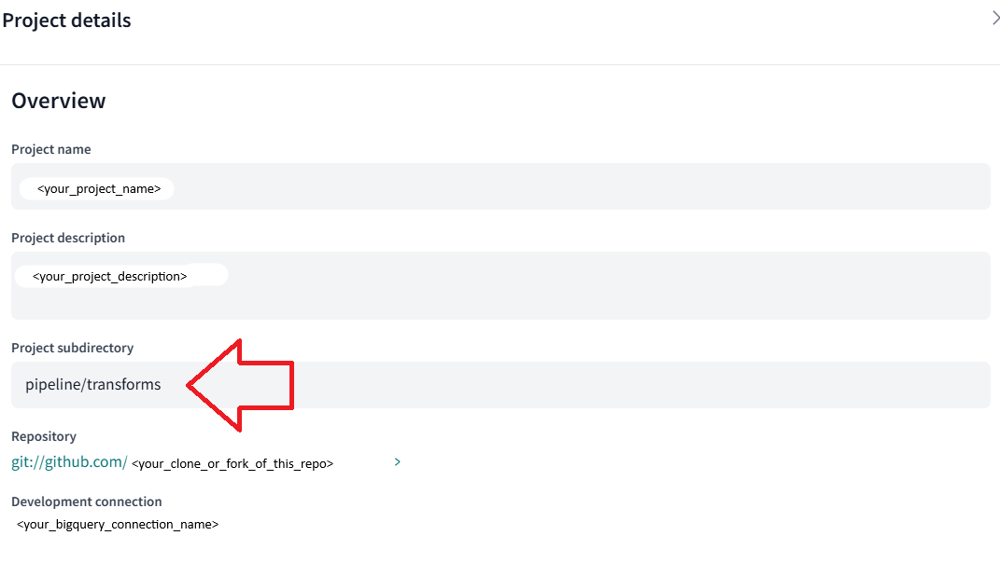
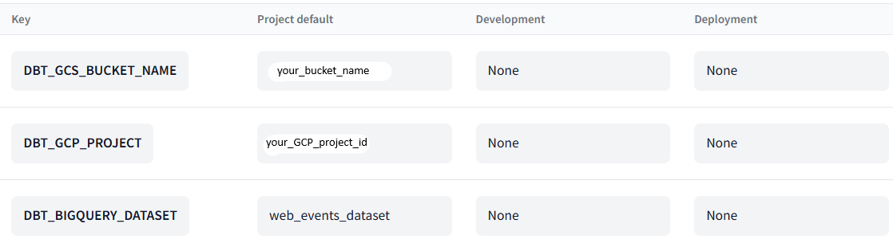

# Running the dbt cloud project

## 1. Initial dbt Cloud project setup
Note: These instructions assume you have not created a dbt Cloud project before. The free developer tier of dbt Cloud only
allows 1 project, so you may need to delete or reconfigure your project if you already have an existing one.

1. Fork or clone this repository to your own GitHub account.
2. Log in to the [dbt Cloud IDE](https://cloud.getdbt.com/login)
3. If this is your first time logging in, you will see a button to set up a new project. Otherwise, click on 
   your name > `Your profile` > `Projects`.
4. Start creating a new project. Give your project a name and description.
6. Select `BigQuery` as your warehouse and give the connection a name.
7. Click "Upload a Service Account JSON file" and upload the json file you downloaded earlier in the `infra-setup` part.
8. Under `Optional Settings`, set the `Location` to `us-central1` (or whatever you have set as the `region` in your 
   Terraform setup earlier)
9. Click the button to test connection to the warehouse.
10. Move on to `Setup a Repository`. Select `GitHub` > `Connect GitHub Account` > `Authorize dbt Cloud`
11. Once you are redirected back to dbt Cloud, select `GitHub` > `Configure GitHub Integration`. You will be brought to GitHub where you should choose `Only select repositories`
and choose your fork/clone of this repository. Once you are back in dbt Cloud again, select `GitHub` again and select your repository.
12. Your project will be created. Go to the dashboard and click on `Settings` in the top right. Click `Edit` and type 
`pipeline/transforms` under `Project subdirectory`.
    
    
Ensure your project details are similar to the above before you move on to the next step.

## 2. Create a deployment environment
1. Click `Deploy` > `Environments` > `Create environment`
2. Give the environment a name (e.g. Deployment) and select `Production` as deployment type.
3. Choose the connection you created earlier. Under `Dataset`, enter your BigQuery dataset created earlier, which
   should be`web_events_dataset`. Click `Test Connection`, then `Save`.
4. Go back to `Environments` and go to the `Environment variables` tab.
5. Click `Add variable` and create the following:
   * Key: `DBT_GCS_BUCKET_NAME` , Project Default: <your_bucket_name_here>
   * Key: `DBT_GCP_PROJECT` , Project Default: <your_GCP_project_id_here>
   * Key: `DBT_BIGQUERY_DATASET` , Project Default: `web_events_dataset`
   
   **Leave the other fields blank**.

Once you are done, you will see something similar to this:

> [!IMPORTANT]  
> Leave the fields under the other columns blank. Please do not write `None` in these columns. dbt will autofill them.

## 3. Set up & run jobs
1. Go to `Deploy` > `Jobs` > `Create job` > `Deploy job`
2. First job:
   1. Name the job `First build` and choose `Deployment` for the environment.
   2. Copy these commands line-by-line into your execution settings:
   ```shell
   dbt run-operation stage_external_sources --vars "ext_full_refresh: true"
   dbt --no-partial-parse build --full-refresh
   ```
   3. Check the box labelled `Generate docs on run`, then click `Save` to create the job.
   4. Click `Run now` to run this job. Once this job is done, you will be able to see all the tables in the BigQuery 
      dataset.
3. Hourly job:
   1. Create another deploy job and name it `Hourly build`
   2. Under execution settings, paste this single command: `dbt --no-partial-parse build`
   3. Under `Schedule`, select `Run on schedule`, you can try out different ways to schedule run. As an example, let's 
      schedule it to run at 5 minutes past the hour every hour: Select `Cron schedule` and type `5 * * * *` as the 
      custom cron schedule.
   4. Click `Save` to create the job. There is no need to run the job as dbt Cloud will automatically run it based on 
      your schedule.

> [!TIP]
> You can go to `Deploy` > `Run history` to see the runs and their logs. Don't be alarmed if you see 
> a warning for the `dbt_utils_accepted_range_fact_session_events_session_seconds__False__0` test in the build 
> command. This is normal as some users (of the fake music website) may have just started their session, so the session
> length is 0 seconds until new events come in. Just take note of this when making your dashboards.

> [!WARNING]  
> Once you have completed the project, remember to delete the jobs
> so that you don't incur unnecessary costs for BigQuery.
