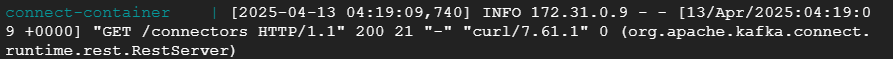

# Running the ingestion pipeline

## 1. Installing docker & docker-compose
1. Go to the compute engine [VM instances page](https://console.cloud.google.com/compute/instances)
2. Click on the compute engine you created earlier via Terraform (e.g., named `eventsim-kafka-instance`).
3. Under the `Details` tab, click the button that says `SSH`.
4. A new **SSH-in-browser** window will open. When prompted, click `Authorize` to continue and you will see the terminal.
5. Install docker by running:
```shell
sudo apt-get update && sudo apt-get install docker.io
```
6. Run the following command to enable you to use docker without root access:
```shell
sudo gpasswd -a $USER docker && sudo service docker restart
```
7. Restart the ssh window by closing it then clicking `SSH` again.
8. Check that docker is working by running `docker run hello-world`
9. Install docker-compose:
```shell
mkdir bin && \
wget https://github.com/docker/compose/releases/download/v2.34.0/docker-compose-linux-x86_64 -O ~/bin/docker-compose
```
10. Make docker-compose executable by running `chmod +x ~/bin/docker-compose`
11. Add the following line to the end of `~/.bashrc` using a text editor (e.g. `vim ~/.bashrc` or `nano ~/.bashrc`):
```shell
export PATH="${HOME}/bin:${PATH}"
```
If you are not sure how to use nano to edit files, you can refer to [this part of Alexey's video](https://youtu.be/ae-CV2KfoN0?si=o31VTXYCzTtoTej9&t=1510)
12. Run `source .bashrc` for the changes to take effect.

## 2. Ingesting location & song datasets
1. Clone this git repo and navigate to the ingestion folder:
```shell
git clone https://github.com/cpwill01/webalytics-data-pipeline.git && \
cd webalytics-data-pipeline/pipeline/ingestion/locations-and-songs
```
2. Set the environment variable, replacing "your_bucket_name_here" with the 
   bucket you created earlier.
```shell
export GCS_BUCKET_NAME=your_bucket_name_here
```
3. Deploy the ingestion pipeline by running `docker-compose up` 
4. Once the program exits, you should have a new path (`raw/flat-files`) in your bucket with 2 files (`locations.parquet` and 
   `songs.parquet`).
   
## 3. Running eventsim & Ingesting the event data
1. Navigate to the eventsim folder:
```shell
cd ~/webalytics-data-pipeline/pipeline/ingestion/eventsim
```
2. Source this script to set the environment variables:
```shell
source ./scripts/setup_environment.sh
```
3. Deploy eventsim, Kafka, and the Kafka Connect server by running the docker compose in **detached mode**:
```shell
docker-compose up -d
```
4. Follow the docker compose logs by running `docker-compose logs -f`
5. Wait until you see the heartbeat message of the Kafka Connect REST server, similar to this:


   
6. Without closing the current terminal, open a second SSH-in-browser terminal by clicking SSH again (from step 1.3).
7. Navigate to the Kafka Connect configs folder and send the GCS sink config to the server:
```shell
cd ~/webalytics-data-pipeline/pipeline/ingestion/eventsim/configs/kafka-connect && \
curl -X POST -H "Content-Type: application/json" --data @connect_sink_gcs.json http://localhost:8083/connectors
```
8. On the logs terminal, you will see some logs indicating that the Kafka Connect container received the config and is
   is connected to the Kafka brokers. After a while, you should see the heartbeat message again.
9. In about 5 minutes, you will start seeing the event data files in your GCS bucket. While waiting, you can move on to
   set up the dbt Cloud project.
10. Once everything is working, you can safely press `Ctrl`+`C` to exit the logs without shutting down the containers.

> [!WARNING]  
> Once you have completed the project, remember to stop all containers by running
> `cd ~/webalytics-data-pipeline/pipeline/ingestion/eventsim && docker-compose down`
> so that you don't incur unnecessary costs.
